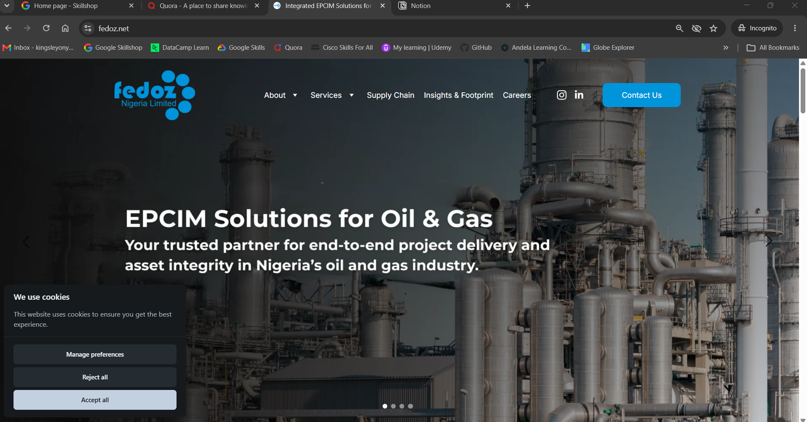
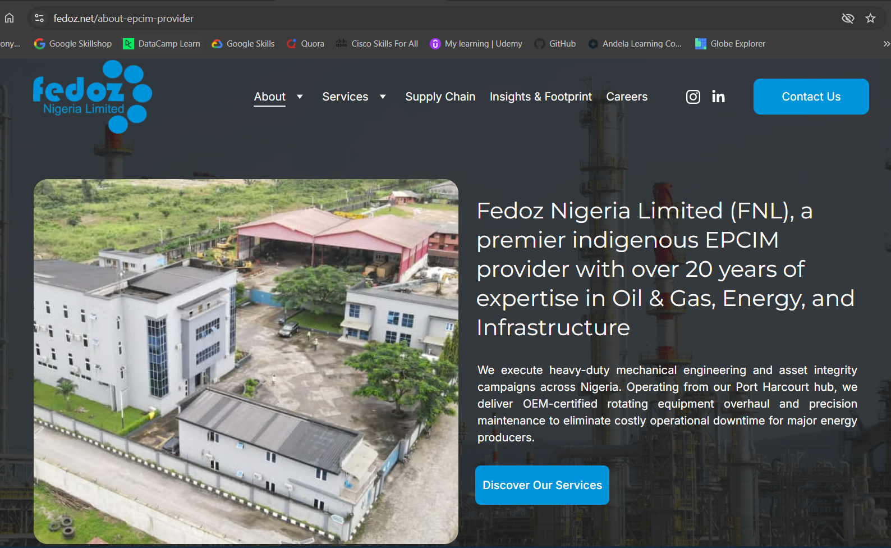
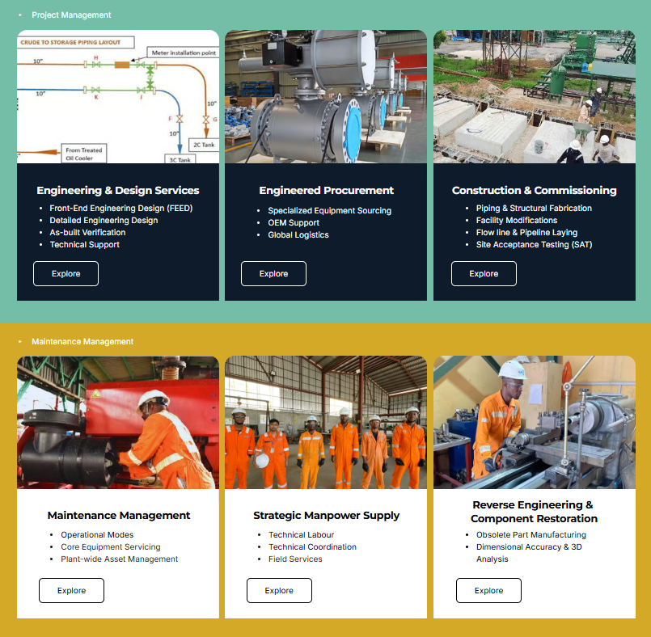
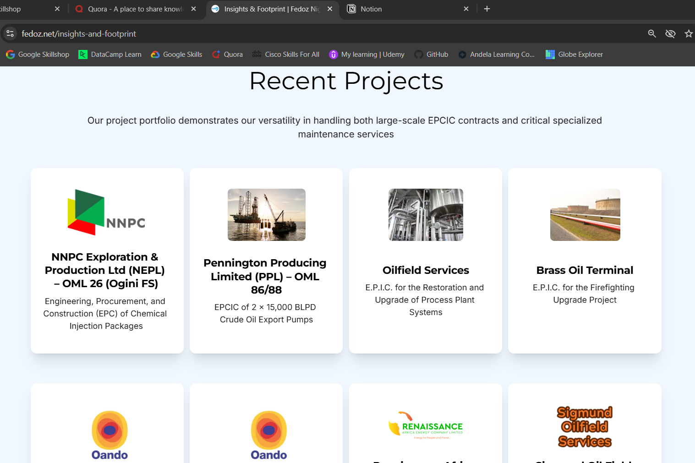
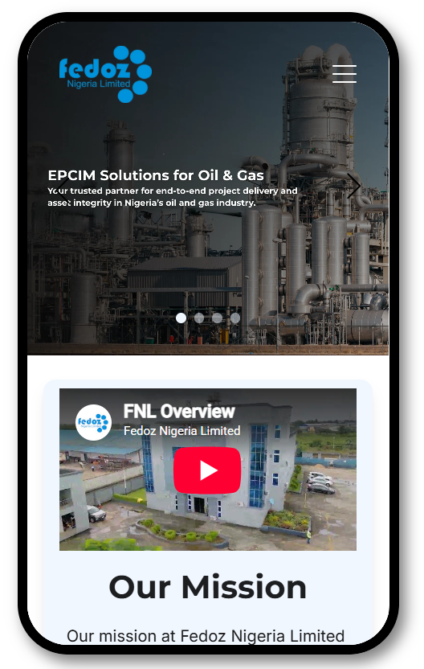
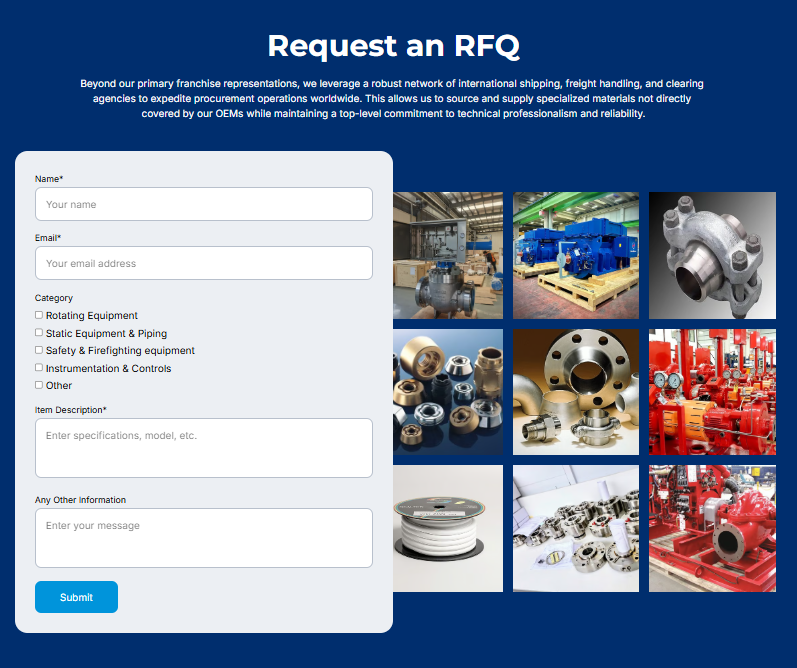

# Fedoz Nigeria Limited — Corporate Website

> A modern corporate B2B website designed and developed for **Fedoz Nigeria Limited**, an indigenous engineering and energy services company.

[](https://www.fedoz.net)

---

## Overview

This project involved the design and development of the corporate website for **Fedoz Nigeria Limited**, an engineering and energy services company serving the oil and gas industry.

The website was designed to strengthen Fedoz's digital presence, communicate its technical capabilities, showcase its projects and services, and provide clients, partners, and other stakeholders with a clear and professional view of the organisation.

The project focused on combining **corporate identity, user experience, responsive design and clear information architecture** to create a website suited to a B2B engineering audience.

---

## Project Goals

The primary objectives of the project were to:

* Establish a stronger corporate digital presence
* Clearly communicate Fedoz's services and technical capabilities
* Present the company's projects and experience in a structured format
* Improve navigation and accessibility for prospective clients and partners
* Create a responsive experience across desktop, tablet, and mobile devices
* Reinforce the company's professional identity and industry positioning
* Provide a scalable platform for future content and business updates

---

## Key Features

### Corporate Profile

A structured presentation of the company's background, capabilities, values, and industry experience.

### Services & Capabilities

Dedicated sections for communicating Fedoz's engineering, equipment, and technical service offerings.

### Project Showcase

A portfolio-oriented presentation of selected projects and activities to demonstrate technical experience and delivery capability.

### Responsive Design

The website was designed to provide a consistent user experience across desktop, tablet and mobile devices.

### Clear Information Architecture

Content was organised around the needs of prospective clients, partners and other stakeholders, making key information easier to discover.

### Contact & Enquiry

Clear pathways for visitors to make enquiries and connect with the organisation.

### Corporate Branding

The visual design was aligned with Fedoz's existing corporate identity to provide consistency across its digital presence.

---

## Design Approach

The design approach focused on creating a visual language that communicates:

**Professionalism · Technical Capability · Reliability · Safety · Quality**

Rather than treating the website as simply an online company profile, the design was structured as a digital business platform capable of supporting Fedoz's broader corporate communication and business-development objectives.

The interface uses a clear content hierarchy, structured sections, a visual project presentation, and responsive layouts to make technical and corporate information easier to understand.

---

## Technology Stack

The website was designed and developed using a combination of no-code, visual design, content research and custom styling tools.

**Website**

* Hostinger Website Builder

**Design & Visual Assets**

* UI/UX Design
* Canva
* Corporate Branding

**Customization**

* Custom CSS/HTML

**Content Research & Development**

* NotebookLM — used to research and synthesise information from existing company documentation and support the development of structured, optimised website content.

---

## Website Structure

The website was structured around the following core areas:

```text
Home
├── About
├── Services
├── Supply Chain
├── Insights & Footprint
├── Careers
└── Contact
```


---

## Screenshots

### Homepage



The homepage introduces the organisation, its core capabilities and value proposition while providing clear navigation to key areas of the website.

---

### About / Corporate Profile



A structured presentation of Fedoz's corporate identity, background, experience and areas of operation.

---

### Services & Capabilities



The services section presents the organisation's technical and engineering capabilities in a clear, client-focused format.

---

### Projects



The project section shows selected activities and highlights the organisation's experience across its areas of operation.

---

### Mobile Experience



Responsive layouts ensure that the website remains accessible and usable across different screen sizes.

---

### B2B Enquiry & Lead Generation



To support the website's B2B objectives, enquiry forms were incorporated across relevant service pages and the main contact page.

This provides prospective clients with a direct pathway to enquire about specific services, helping connect the website's technical service offerings with potential business opportunities.

The approach was designed to make it easier for visitors to move from discovering a service → requesting information → initiating a business conversation.

---

## Live Website

**[Visit fedoz.net](https://www.fedoz.net)**

---

## Project Role

**Role:** Web Designer, Content Strategist & Developer

**Responsibilities included:**

* Website planning and information architecture
* UI/UX and visual design
* Corporate content research and restructuring
* Website development using Hostinger Website Builder
* Custom CSS implementation
* Content optimisation based on existing company documentation
* Visual asset preparation and image editing
* Service-page and B2B enquiry-form implementation
* Responsive optimisation
* Website testing and refinement
* Deployment and ongoing content updates

---

## Design & Development Highlights

This project provided an opportunity to work on a real-world **B2B corporate website within the engineering and energy sector**, where the digital experience needed to balance technical information with clear business communication.

Key considerations included:

* Presenting technical services to a non-technical visitor
* Maintaining a professional corporate appearance
* Structuring large amounts of company information
* Highlighting projects and capabilities
* Designing for mobile accessibility
* Creating a foundation for ongoing corporate communications

---

## Portfolio Note

This repository serves as a **portfolio and project documentation reference** for the Fedoz Nigeria Limited corporate website.

The live website and brand assets belong to **Fedoz Nigeria Limited**. The repository does not contain confidential information, credentials, proprietary client data, or restricted production assets.

---

## Credits

**Website Design & Development:**
Chisom Onyeka

**Client:**
Fedoz Nigeria Limited

**Live Website:**
https://www.fedoz.net

---

## License

This repository is intended for portfolio and documentation purposes.

The website design, content, branding, and associated assets are the property of their respective owners and should not be reproduced or redistributed without permission.
